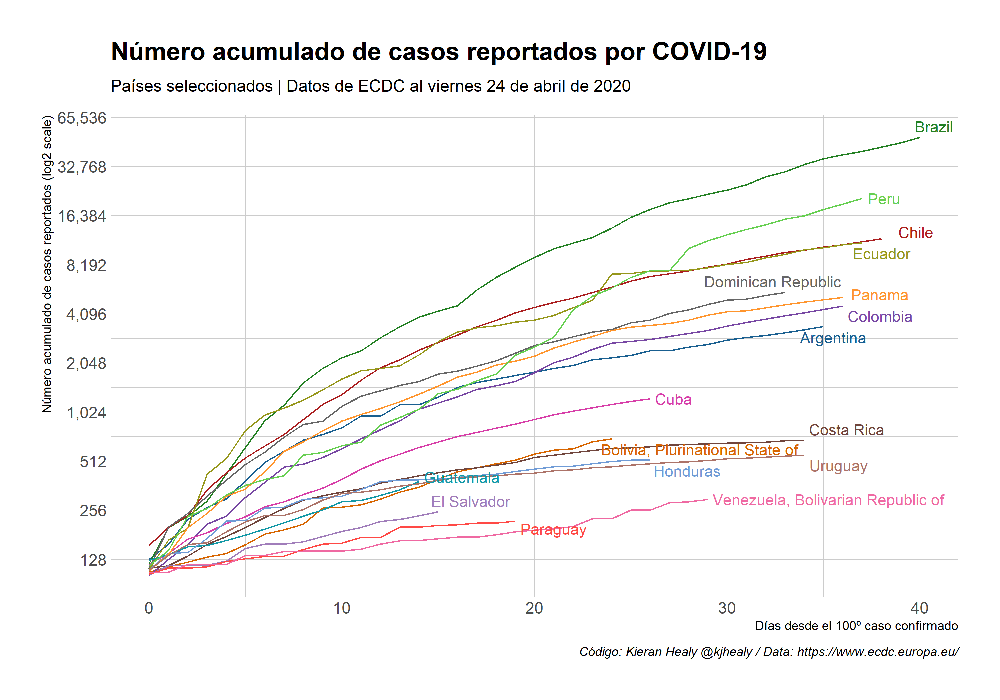
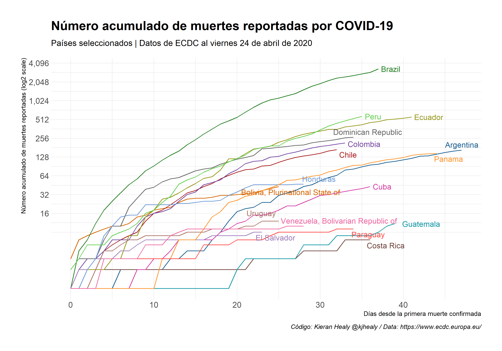

# Traducción e Interactividad de datos Covid19 

### Basado en código y data compartida por Kieran Healy @kjhealy (casos positivos y decesos)

#### El acumulado de *casos positivos* para países seleccionados

[Acá una versión interactiva](https://tuqmano.github.io/traduccion_plots_covid/index.html)

---

#### El acumulado de *decesos* para países seleccionados

[Acá una versión interactiva](https://tuqmano.github.io/traduccion_plots_covid/interactive_decesos.html)

#### Comparación entre países de LATAM 

[Acá una versión interactiva](https://tuqmano.github.io/traduccion_plots_covid/interactive_casos_latam.html)

---

[Acá una versión interactiva](https://tuqmano.github.io/traduccion_plots_covid/interactive_decesos_latam.html)
ivo de paises LATAM

