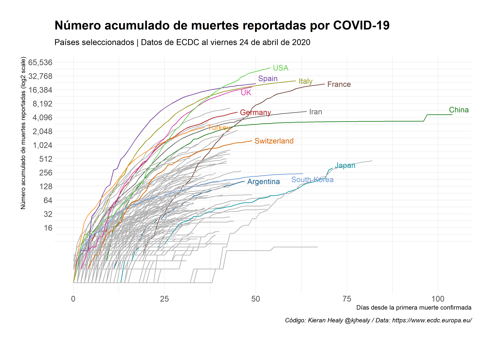

```{r setup, include = FALSE}
knitr::opts_chunk$set(echo = TRUE)
```


# Traducción e Interactividad de datos Covid19 

### Basado en código y data compartida por Kieran Healy @kjhealy (casos positivos y decesos)


#### El acumulado de *casos positivos* para países seleccionados


[Acá una versión interactiva](https://tuqmano.github.io/traduccion_plots_covid/interactive_casos.html)

---

#### El acumulado de *decesos* para países seleccionados



[Acá una versión interactiva](https://tuqmano.github.io/traduccion_plots_covid/interactive_decesos.html)


## Comparativo entre países de LATAM 


[Acá una versión interactiva](https://tuqmano.github.io/traduccion_plots_covid/interactive_casos_latam.html)


---


[Acá una versión interactiva](https://tuqmano.github.io/traduccion_plots_covid/interactive_decesos_latam.html)


